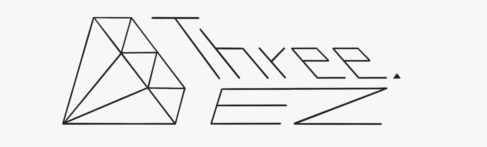

<div align="center">
  <h1>Three.ez - Main</h1>
  <p>
    <em>Simplify your <b>three.js</b> application development with <b>three.ez</b>!</em>
  </p>

  <div align="left">
    
  - <b><a href="https://github.com/agargaro/instanced-mesh">three.ez/instanced-mesh</a></b> - Enhanced <code>InstancedMesh</code> with features for performance and usability
  - <b><a href="https://github.com/agargaro/batched-mesh-extensions">three.ez/batched-mesh-extensions</a></b> - <code>BatchedMesh</code> extension methods and enhancements for better performance and usability
    
  </div>

  <br>
  
  <!--  <br> -->
  [](https://discord.gg/MVTwrdX3JM)
  [](https://www.npmjs.com/package/@three.ez/main)
  [](https://github.com/agargaro/three.ez)
  [](https://bundlephobia.com/package/@three.ez/main)
  [](https://sonarcloud.io/summary/new_code?id=agargaro_three.ez)
  [](https://deepscan.io/dashboard#view=project&tid=21196&pid=25445&bid=796375)
</div>

Simplifies the most common operations of `three.js` applications, extends the functionalities of `Object3D` and `Scene` classes, making their usage more straightforward, and introduce utility classes.

```typescript
import { Scene, Mesh, BoxGeometry, MeshNormalMaterial } from 'three';
import { Main, PerspectiveCameraAuto } from '@three.ez/main';

const box = new Mesh(new BoxGeometry(), new MeshNormalMaterial());
box.draggable = true; // make it draggable
box.on('animate', (e) => box.rotateX(e.delta).rotateY(e.delta * 2)); // animate it every frame
box.on(['pointerover', 'pointerout'], (e) => box.scale.setScalar(e.type === 'pointerover' ? 1.5 : 1));

const scene = new Scene().add(box);
const main = new Main(); // init inside the renderer, and handle events, resize, etc
main.createView({ scene, camera: new PerspectiveCameraAuto().translateZ(10) }); // create the view to be rendered
```

## Related libraries

## 🧑‍💻 Live examples

These examples use `vite`, and some mobile devices may run out of memory.

[Examples Collection](https://stackblitz.com/@agargaro/collections/three-ez)

- [Template](https://stackblitz.com/edit/three-ez-template?file=src%2Fmain.ts)
— [Template Extended](https://stackblitz.com/edit/three-ez-template-extended?file=src%2Fmain.ts)
— [Template No Vite](https://stackblitz.com/edit/three-ez-template-no-vite?file=index.ts)
- [Smart Rendering](https://stackblitz.com/edit/three-ez-smart-rendering?file=src%2Fmain.ts)
- [Multiple Views](https://stackblitz.com/edit/three-ez-multiple-views?file=src%2Fmain.ts)
— [Multiple Views Wireframe](https://stackblitz.com/edit/three-ez-multiple-views-wireframe?file=src%2Fmain.ts)
— [Multiple Views Switch](https://stackblitz.com/edit/three-ez-multiple-views-switch?file=src%2Fmain.ts)
- [Asset Management](https://stackblitz.com/edit/three-ez-asset-management?file=src%2Fmain.ts)
- [Binding](https://stackblitz.com/edit/three-ez-binding?file=src%2Fmain.ts)
— [Binding Collisions](https://stackblitz.com/edit/three-ez-binding-collisions?file=src%2Fmain.ts)
- [Events](https://stackblitz.com/edit/three-ez-events?file=src%2Fmain.ts)
— [Click On Scene To Add Box](https://stackblitz.com/edit/three-ez-click-on-scene-to-add-box?file=src%2Fmain.ts)
- [Focus](https://stackblitz.com/edit/three-ez-focus?file=src%2Fmain.ts)
— [Focus Outline (post-processing)](https://stackblitz.com/edit/three-ez-focus-outline?file=src%2Fmain.ts)
- [Drag & Drop](https://stackblitz.com/edit/three-ez-drag-drop?file=src%2Fmain.ts)
— [LOD Draggable](https://stackblitz.com/edit/three-ez-lod-draggable?file=src%2Fmain.ts)
— [Drag Limits](https://stackblitz.com/edit/three-ez-drag-limits?file=src%2Fmain.ts)
- [Continuous Raycasting](https://stackblitz.com/edit/three-ez-continuous-raycasting?file=src%2Fmain.ts)
- [Hitbox](https://stackblitz.com/edit/three-ez-hitbox?file=src%2Fmain.ts)
- [Tweening](https://stackblitz.com/edit/three-ez-tweening?file=src%2Fmain.ts)
— [Tweening Custom Progress](https://stackblitz.com/edit/three-ez-tweening-custom-progress?file=src%2Fmain.ts)
- [InstancedMeshEntity](https://stackblitz.com/edit/three-ez-instancedmeshentity?file=src%2Fmain.ts)
— [InstancedMeshEntity Performance](https://stackblitz.com/edit/three-ez-instancedmeshentity-performance?file=src%2Fmain.ts)
- [Draggable Box OrbitControls](https://stackblitz.com/edit/three-ez-draggable-box-orbitcontrols?file=src%2Fmain.ts)
- [Textbox (troika-three-text)](https://stackblitz.com/edit/three-ez-textbox?file=src%2Fmain.ts)
- [Bubble Refraction](https://stackblitz.com/edit/three-ez-bubble-refraction?file=src%2Fmain.ts,src%2Ftext.ts,src%2Fparticles.ts,src%2Fbubble.ts,src%2FbubbleMaterial.ts,src%2Fscene.ts)

## 📚 Documentation

The tutorial is available [here](https://agargaro.github.io/three.ez/docs/tutorial) *(work in progress)*. <br>
The API documentation is available [here](https://agargaro.github.io/three.ez/docs/api).

## ⬇️ Installation

You can install it via npm using the following command:

```bash
npm install @three.ez/main
```

Or can import it from CDN:

```html
<script type="importmap">
{
  "imports": {
    "three": "https://cdn.jsdelivr.net/npm/three/build/three.module.js",
    "three/addons/": "https://cdn.jsdelivr.net/npm/three/examples/jsm/",
    "@three.ez/main": "https://cdn.jsdelivr.net/npm/@three.ez/main/build/index.js"
  }
}
</script>
```

## ❔ Questions?

Need help? Join us on [Discord](https://discord.gg/MVTwrdX3JM) or open an issue on GitHub.

## ⭐ Like it?

If you like this project, please leave a star. Thank you! ❤️

## 🚀 Features

### Event programming

Add interactions to `Object3D` through programmable events, similar to `DOM events`, including a propagation system. <br>
See events list here: [Interaction](https://agargaro.github.io/three.ez/docs/tutorial/events/interaction), [Miscellaneous](https://agargaro.github.io/three.ez/docs/tutorial/events/misc), [Update](https://agargaro.github.io/three.ez/docs/tutorial/events/update).

```typescript
const box = new Mesh(geometry, material);
box.on('click', (e) => e.stopPropagation());
box.on('animate', (e) => console.log('animate'));
box.on('positionchange', () => console.log('position changed'));
```

### Drag and drop

Integrate drag and drop functionality. The drag is cancelled by pressing *ESC*.

```typescript
const box = new Mesh(geometry, material);
box.draggable = true;
box.findDropTarget = true;
box.on('drag', (e) => console.log(`new position: ${e.position}`));

const plane = new Mesh(geometry, material);
plane.on('drop', (e) => console.log(`obj dropped on this: ${e.relatedTarget}`));
```

### Focus and blur

Enhance interactivity with focus and blur events.

```typescript
const box = new Mesh(geometry, material);
box.focusable = true; // default is true
box.on('focus', (e) => console.log('focused'));
box.on('blur', (e) => console.log('focus lost'));
```

### Object3D property binding

Streamline the management of `Object3D` properties.

```typescript
const box = new Mesh(geometry, material);
box.bindProperty('visible', () => box.parent?.enabled); 
```

### Automatic resize handling

Automatically resizes the `Renderer`, `Camera`, and `EffectComposer`. <br>
Utilize the `viewportResize` event to easily set the resolution for custom shaders.

```typescript
const line = new Line2(geometry, material);
line.on('viewportresize', (e) => material.resolution.set(e.width, e.height));
```

### Smart rendering

Optimize performance by rendering frames only when necessary, reducing computational overhead. <br>
Automatically identifies changes in *position, scale, rotation, visibility, focus, blurring and addition or removal of objects*.

```typescript
const scene = new Scene();
scene.activeSmartRendering();

const box = new Mesh(new BoxGeometry(), new MeshLambertMaterial({ color: 'green' }));
box.draggable = true; // if you drag the frame, it automatically detects changes and renders the frame

box.material.color.set('yellow');
box.needsRender = true; // necessary because color change cannot be automatically detected
```

### Simplified multiple rendering

Effortlessly manage rendering for multiple scenes or viewports within a single canvas.

```typescript
const main = new Main(); 
main.createView({ scene, camera, viewport: { left: 0, bottom: 0, width: 0.5, height: 1 } });
main.createView({ scene, camera, viewport: { left: 0.5, bottom: 0, width: 0.5, height: 1 } });
```

### Asset management

Efficiently load and preload the assets for your 3D projects.

*load:*

```typescript
const audioBuffer = await Asset.load(AudioLoader, 'audio.mp3', onProgressCallback, onErrorCallback);
```

*preload:*

```typescript
// soldier.js
Asset.preload(GLTFLoader, 'https://threejs.org/examples/models/gltf/Soldier.glb');

export class Soldier extends Group {
  constructor() {
    super();
    const gltf = Asset.get('https://threejs.org/examples/models/gltf/Soldier.glb');
    this.add(...gltf.scene.children);
  }
}

// main.js
await Asset.preloadAllPending({ onProgress: (e) => console.log(e * 100 + '%'), onError: (e) => console.error(e) });
const main = new Main();
const soldier = new Soldier();
```

### Tweening

Create smooth animations effortlessly with built-in tweening.

```typescript
box.tween().by(1000, { position: new Vector3(0, 0.5, 0) }, { easing: 'easeInOutBack' }).yoyoForever().start();

new Tween(box)
  .by(2000, { scale: 1, rotation: new Euler(Math.PI * 2, Math.PI, 0) }, { easing: 'easeOutElastic' })
  .delay(200)
  .to(1000, { scale: 1 }, { easing: 'easeOutBounce' })
  .start();
```

### Raycasting customisable

Choose between continuous or mouse movement-based raycasting, optimizing intersection operations. <br>
Set which objects to intersect from the main raycasting.

```typescript
const scene = new Scene();
scene.continuousRaycasting = true; // default is false

const box = new Mesh(geometry, material);
box.interceptByRaycaster = false; // default is true
```

### Hitbox functionality

Leverage hitboxes for customized intersections or simplified calculations.

```typescript
const ring = new Mesh(new RingGeometry(1, 1.5), new MeshBasicMaterial());
ring.hitboxes = [new Hitbox(new CircleGeometry(1.5))]; // intercept also inside the ring
```

### 🔍 Query

Find and select `Object3D` using powerful query selectors.

```typescript
scene.querySelectorAll('Mesh'); // Selects all the meshes in the scene.
scene.querySelectorAll('[name=box]'); // Selects all Object3D that have 'box' as their name.
scene.querySelectorAll('[name*=box]'); // Selects all Object3D that have 'box' anywhere in their name.
scene.querySelectorAll('Mesh.even'); // Selects meshes with both 'Mesh' type and 'even' tag.
scene.querySelectorAll('Group .even'); // Selects all Object3D with 'even' tag that are children of a 'Group'.
scene.querySelectorAll('Group > .even'); // Selects all direct children with 'even' tag under a 'Group'.
scene.querySelectorAll('Mesh, SkinnedMesh'); // Selects all meshes and skinned meshes in the scene.
```
